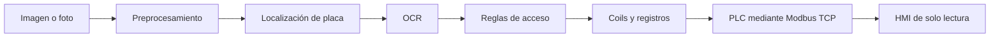

# Placas-PLC: de la imagen a la señal

Proyecto didáctico de **Automatización Industrial — Ingeniería Eléctrica, Universidad Tecnológica de Pereira**. Aprende a leer placas con Python, decidir acceso vehicular y comunicar señales a un PLC.

## Empieza aquí

1. Empieza con [Windows y PowerShell](docs/tutoriales/00-windows.md) o con la [instalación general](docs/tutoriales/00-instalacion.md).
2. Completa los [tutoriales prácticos por etapas](docs/README.md).
3. Registra cada experimento con la [plantilla de informe](docs/plantillas/informe.md).

No necesitas un PLC para las primeras etapas. El repositorio contiene una implementación para explorar y modificar: los retos indican qué desarrollar y cómo comprobarlo.



## Primera ejecución en Windows (PowerShell)

Prepara Git y Python 3.11 de 64 bits. Ejecuta las líneas una a una:

```powershell
git clone https://github.com/kevin-ortega2724/placas-plc.git
cd placas-plc
py -3.11 -m venv .venv
.\.venv\Scripts\python.exe -m pip install -r requirements.txt
.\.venv\Scripts\python.exe -m pip install -e .
.\.venv\Scripts\python.exe -m placas.generador --n 20 --semilla 42
.\.venv\Scripts\python.exe -m streamlit run app/interfaz.py
```

Abre `http://localhost:8501`. No necesitas activar scripts de PowerShell. La [guía completa para Windows](docs/tutoriales/00-windows.md) explica instalación, pruebas, terminales para Modbus y problemas frecuentes. La validación del mantenedor se realizó en Linux; queda pendiente registrar una ejecución en Windows.

## Primera ejecución en Linux / macOS

Usa Python 3.11 como versión de referencia (el paquete declara Python >=3.10).

```bash
git clone https://github.com/kevin-ortega2724/placas-plc.git
cd placas-plc
python3 -m venv .venv
source .venv/bin/activate
python -m pip install -r requirements.txt
python -m pip install -e .
python -m placas.generador --n 20 --semilla 42
python -m streamlit run app/interfaz.py
```

Abre `http://localhost:8501`, selecciona una imagen y deja **PLC simulado** como destino. EasyOCR puede descargar modelos en la primera lectura; después procesa localmente en CPU. Para Windows y comprobaciones del entorno, consulta el [tutorial de instalación](docs/tutoriales/00-instalacion.md).

## Ruta de aprendizaje

| Etapa | Qué vas a conseguir | Tutorial | Clases |
|---|---|---|---|
| 0. Preparación | Instalar y verificar el entorno | [Instalación](docs/tutoriales/00-instalacion.md) | [00](docs/clases/fase00.md) |
| 1. Datos y visión | Generar imágenes, localizar y leer placas | [Visión](docs/tutoriales/01-vision.md) | 01–06 |
| 2. Decisiones | Comprobar prioridades y señales sin depender del OCR | [Reglas](docs/tutoriales/02-reglas.md) | 07–08 |
| 3. Interfaz | Procesar imágenes y comparar resultados | [Interfaz](docs/tutoriales/03-interfaz.md) | 09 |
| 4. Comunicación | Enviar señales por Modbus TCP | [Modbus](docs/tutoriales/04-modbus.md) | 10 |
| 5. Control y supervisión | Conectar PLC y monitor independiente | [PLC y HMI](docs/tutoriales/05-plc-hmi.md) | 11–12 |
| 6. Entrega | Medir, explicar fallas y demostrar el sistema | [Proyecto final](docs/tutoriales/06-proyecto-final.md) | 13 |

El [índice de documentación](docs/README.md) enlaza todas las clases. Cada tutorial incluye pasos, pruebas, resultados esperados y un criterio para avanzar.

## Qué contiene el repositorio

| Ruta | Responsabilidad |
|---|---|
| `src/placas/` | Adquisición, visión, reglas, señales, simulación y comunicación |
| `app/interfaz.py` | Interfaz Streamlit de procesamiento y envío |
| `config/` | Reglas didácticas y listas de placas de ejemplo |
| `hmi/` | Monitor de solo lectura y servidor Modbus de prueba |
| `plc/openplc/` | Programa ST, guía ladder, mapa de direcciones y protocolo de pruebas |
| `tests/` | Pruebas automáticas por módulo |
| `docs/clases/` | 14 guías docentes: objetivos, conceptos, retos y evaluación |
| `docs/tutoriales/` | Prácticas guiadas para estudiantes |
| `notebooks/` | Exploración de resultados |
| `data/`, `salidas/` | Datos locales y resultados; no se publican |

## Verifica tu trabajo

```bash
python -m pytest -q
```

Las pruebas que sustituyen el OCR o la conexión por objetos de prueba verifican lógica; la lectura de imágenes reales y la integración con OpenPLC requieren además las prácticas manuales. Consulta [problemas frecuentes](docs/SOLUCION_DE_PROBLEMAS.md).

## Alcance de la versión

- La interfaz permite carpeta de PNG, archivos subidos y fotos desde el navegador; no ofrece video continuo.
- El PLC simulado está dentro del proceso de la interfaz; su demo de consola no abre un servidor Modbus.
- El servidor de prueba almacena señales; no ejecuta ladder ni genera contadores de ingresos.
- La interfaz envía por Modbus al ejecutarse y cierra la conexión. No mantiene un watchdog continuo. Las lámparas de esa interfaz corresponden al simulador; usa el HMI para observar el PLC externo.
- La configuración de pico y placa es un ejemplo de clase, no una normativa vigente. El flujo base está orientado a placas de carro; motos es una extensión pendiente.

## Historial por fases

Existen etiquetas `fase-00` a `fase-12`. Para estudiar una versión anterior sin alterar tu rama de trabajo:

```bash
git fetch --tags
git worktree add ../placas-fase03 fase-03
```

Las etiquetas son instantáneas históricas: pueden no incluir correcciones o tutoriales actuales. La fase 13 es una actividad de integración, no una etiqueta histórica existente.

## Material y participación

- [Enunciado](ENUNCIADO.md), [ruta de construcción](docs/ROADMAP.md) y [prompts por fase](docs/PROMPTS.md).
- [Cómo contribuir y entregar ejercicios](CONTRIBUTING.md).
- Usa imágenes sintéticas o fotos autorizadas. No publiques imágenes reales, datos personales ni archivos de configuración con información sensible.
